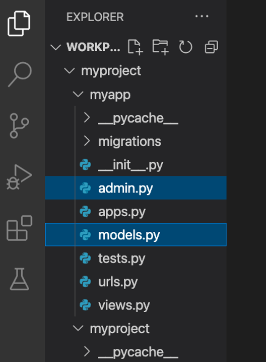
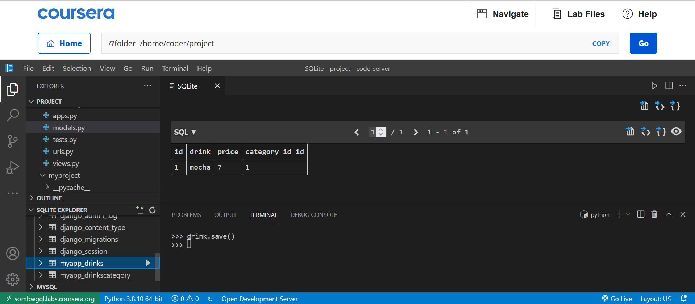

## Models using Foreign Keys

## Using commands Gagik Yeranosyan 2023

- pwd
- cd workplace/myproject
- python manage.py runserver
- python3 manage.py makemigrations
- python3 manage.py migrate
- python3 manage.py showmigrations

  #manage SQLite

- python manage.py shell

  > > > from myapp.models import DrinksCategory
  > > > cat = DrinksCategory(category_name='coffee')
  > > > cat.save()

> > > from myapp.models import Drinks
> > > fk = DrinksCategory.objects.get(pk=1)
> > > drink = Drinks(drink='mocha', price=7, category_id=fk)
> > > drink.save()

### Goal

The learner will learn how to use Foreign Key between two Models in Django

### Objectives

- The learner will create a model called `DrinksCategory`
- The learner will create a second model called `Drinks`, learn to pass the argument for Foreign key in some model attribute and perform migrations.

### Introduction

The labs in this model will focus on the model part of the MVT pattern and in this lab, you will create two models and assign a one-to-many relationship using foreign keys.

### Scenario

So far, the data model of the Little Lemon prototype uses single isolated models. However, you know that as requirements change, so does the complexity of the data model. For example, when describing a Menu, all the food items cannot fall under the same category. Desserts, Appetizers and Entrée will each have their own categories.

Adrian has expressed an interest in creating a webpage that displays the drinks available at the restaurant in order of category.

Your task is to implement this request by making the necessary changes to the data model. You will need to create two new models to represent the `drinks` and `drinks category` tables. Additionally, these tables need to be linked in the manner of a one-to-many relationship, as many drinks can belong to one category.

To implement this relationship, use your understanding of how to create model relationships in Django, using functionality similar to the use of foreign keys in SQL.

### Learner Instructions

Initial Lab Instructions:

This lab will require you to modify the following files:

- models.py
- admin.py

Additionally, you are required to use the command line console inside the terminal of VS Code.

If not open already, go to `Terminal` on the Menu bar at the top of your screen and select 'New Terminal'.

Before you begin this lab, you must activate the virtual environment.

You have already built the project named `myproject` and added an app inside the project called `myapp`.

**Note:**

Follow the instructions below and ensure you check the output at every step and update the necessary files to create different views.

# Steps

**Step 1:**

Expand the `myproject` folder on the left-hand side menu and open the `models.py` file.

**Step 2:**

Create a class called `DrinksCategory` inside `models.py` and inside the class, pass `models.Model` to it as an argument.

**Step 3:**

Add the below attributes with their respective form field types and arguments passed to them.

| **Attribute** | **Form field type** | **Arguments**    |
| ------------- | ------------------- | ---------------- |
| category_name | CharField           | max_length = 200 |

**Step 4:**

Create another class called `Drinks` inside `models.py` and inside the class, pass `models.Model` to it as an argument.

**Step 5:**
Add the below attributes with their respective form field types and arguments passed to them.

| **Attribute** | **Form field type** | **Arguments**    |
| ------------- | ------------------- | ---------------- |
| drink         | CharField           | max_length = 200 |
| price         | IntegerField        |
|               |

**Step 6:**
Inside the class Drinks, create a third attribute called `category_id`, in addition to `drink` and `price`. Assign it the value of ' `models.ForeignKey`' and define the following arguments inside it:

- The name of the first Model `DrinksCategory`.
- The argument `on_delete` with the value `models.PROTECT` assigned to it.
- The argument `default` with a value equal to `None`.

**Step 7:**
Go to the 'admin.py' file under the project directory and register both the models by passing them individually to the function `admin.site.register`.

**Tip:** Make sure you have imported both the models inside the `admin.py` file from `models.py`

**Step 8:**
In the terminal run the command to make migrations.

**Step 9:**
Run the command to perform the migrations.

**Step 10:**
Inside the explorer pane in the left panel of VS Code, Right click on the database `db.sqlite3` that is generated and select `Open Database`.

**Step 11:**
Go to `SQLITE EXPLORER` and click the arrow to expand it. Select `db.sqlite3` and scroll down to check if `myapp_drinks` and `myapp_drinkscategory` tables are generated.

Click on the 'play' button, or right-click and choose `Show Table`.

**Additional step:** You can add entries to these tables with the help of commands you have learned such as `Model.objects.create()` or using the Django admin panel.

**Note: If the table is empty, no results will be displayed.**

**Additional Steps:** You can add entries to these tables with the help of commands you have learned using the Django shell or the Django admin panel.

You will learn how to use the Django admin panel later. For now let's add some database entries using the Django shell.

**Step 12:**
To enter inside the Django shell, run the following command in the terminal:

`python manage.py shell`

Once inside the Django shell, import the `DrinksCategory` model.

`from myapp.models import DrinksCategory`

**Tip:** To ensure you are inside the Django shell, make sure the symbols `>>>` are placed at the start of your commands.

Next, create a variable and instantiate it using keyword arguments to the model class:

`cat = DrinksCategory(category_name='coffee')`

Finally, use the `save()` method to save to the database.

`cat.save()`

In the **SQLITE EXPLORER**, locate the table **myapp_drinkscategory**, right-click and choose **show table**.

**Step 13:**
Now an entry is created in the `DrinksCategory` table, create a drink in the `Drinks` table that uses a foreign key from the `DrinksCategory` table.

Still in the Django shell, import the `DrinksCategory` model.

Create a variable `fk` to store the foreign key, and retrieve it using the `objects.get()` method.

`fk = DrinksCategory.objects.get(pk=1)`

**Note:** The **objects.get()** method retrieves the value from the **DrinksCategory** model.

Next, create another variable drink and instantiate it using keyword arguments to the model class:

`drink = Drinks(drink='mocha', price=7, category_id=fk)`

Finally, use the `save()` method to save to the database.

`drink.save()`

In the **SQLITE EXPLORER**, locate the table **myapp_drinks**, right-click and choose **show table**.

## Concluding Thoughts

In this lab, you practiced creating a one-to-many relationship using models and foreign keys.
